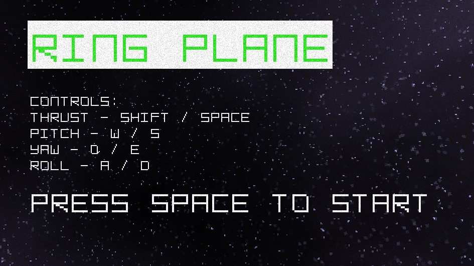
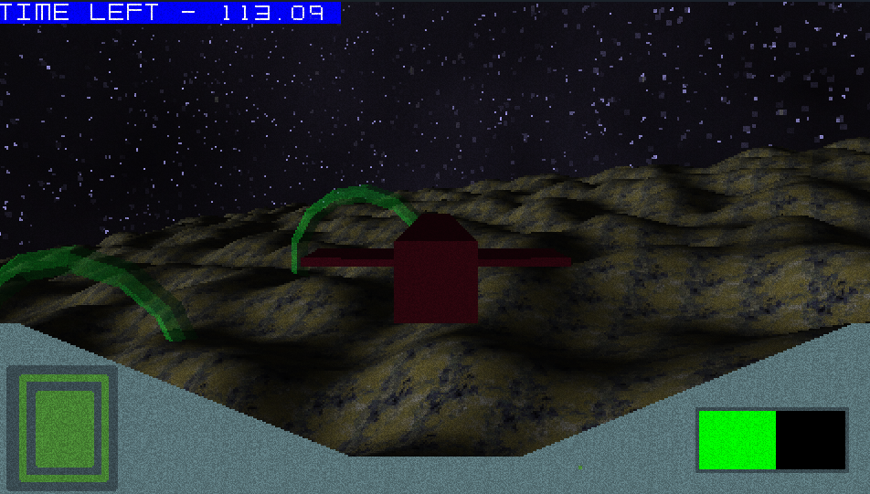

# C Flight Game
Small game I wrote with C and OpenGL.
Collect all 10 rings within 2 minutes and without
crashing into the terrain. It's got a few dependancies.
It uses [Glad](https://glad.dav1d.de/) for the OpenGL (Core 4.6) function loading and [SDL3](https://github.com/libsdl-org/SDL)
for the window/context creation. It also uses [linmath](https://github.com/datenwolf/linmath.h)
for the vector/matrix math, [stb_image.h](https://github.com/nothings/stb)
for image loading and [fastnoiselite.h](https://github.com/Auburn/FastNoiseLite/tree/master/C)
for the terrain generation. You can tell from the 
code I got real lazy once I got to the actual 
game logic such as resources, scenes, entities 
etc. but eh what ya gonna do?
While not libraries I did also use a few tools for
some of the textures. The skybox comes from [SpaceScape](https://github.com/petrocket/spacescape)
and some of the textures were altered using [SLK_img2pixel](https://github.com/Captain4LK/SoftLK-tools).
Highly recommend both if you suck at art like I do

Heres some screenshots anyway

